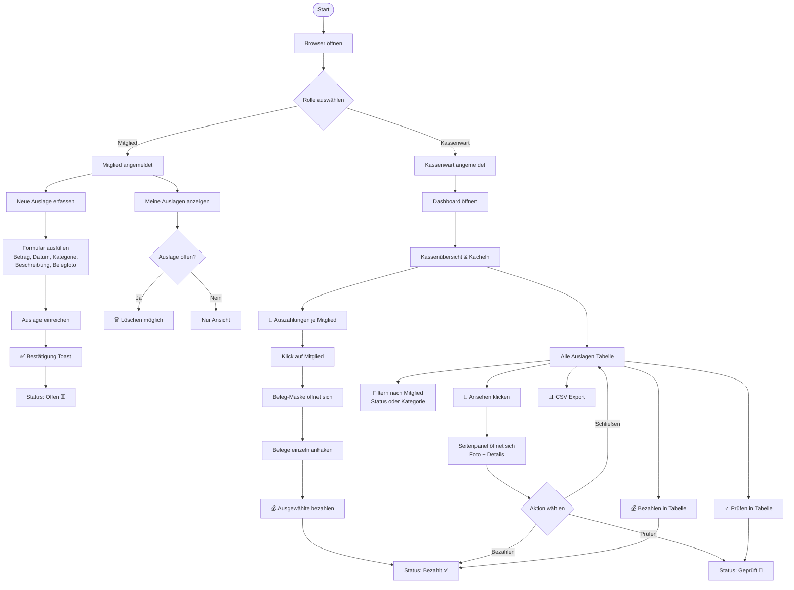

# 🎭 Gut und Aussehend – Auslagen-Verwaltung

Eine browserbasierte App zur Erfassung und Verwaltung von Vereinsauslagen. Mitglieder können Rechnungen mit Belegfoto einreichen, der Kassenwart prüft und verwaltet alle Auslagen zentral.

---

## 📋 Inhaltsverzeichnis

- [Voraussetzungen](#voraussetzungen)
- [Installation](#installation)
- [Nutzung – Mitglied](#nutzung--mitglied)
- [Nutzung – Kassenwart](#nutzung--kassenwart)
- [Status-System](#status-system)
- [Ablaufdiagramm](#ablaufdiagramm)
- [Technische Hinweise](#technische-hinweise)

---

## Voraussetzungen

- Moderner Browser (Chrome, Firefox, Safari, Edge)
- Keine Installation, kein Server, keine Internetverbindung nötig (außer für Tailwind CSS)
- Für den produktiven Einsatz: Raspberry Pi + Cloudflare Tunnel empfohlen

---

## Installation

1. `Index.html` und `logo.png` in denselben Ordner legen
2. `Index.html` per Doppelklick im Browser öffnen
3. Fertig ✅

Für GitHub Pages:
1. Repository erstellen
2. Beide Dateien hochladen
3. GitHub Pages in den Repository-Einstellungen aktivieren
4. URL an alle Vereinsmitglieder weitergeben

---

## Nutzung – Mitglied

### Anmelden
- Name eingeben
- **„Als Mitglied anmelden"** klicken

### Neue Auslage einreichen
1. Oben rechts **„+ Neue Auslage"** klicken
2. Formular ausfüllen:
   - **Betrag** in Euro (z.B. `12.50`)
   - **Datum** des Einkaufs
   - **Kategorie** auswählen (Kostüme, Dekoration, Verpflegung, Transport, Musik/Technik, Sonstiges)
   - **Beschreibung** des Zwecks
   - **Belegfoto** hochladen (JPG oder PNG)
3. **„Auslage einreichen"** klicken
4. Bestätigung erscheint oben als grüner Toast → mit **„OK"** bestätigen

### Eigene Auslagen einsehen
- Unter **„Meine Auslagen"** sind alle eingereichten Auslagen aufgelistet
- Oben sind die Summen **Offen**, **Bezahlt** und **Gesamt** sichtbar
- Auslagen mit Status **Offen** können über den 🗑️ Button gelöscht werden

---

## Nutzung – Kassenwart

### Anmelden
- Name eingeben
- **„Als Kassenwart anmelden"** klicken

### Dashboard-Übersicht
Oben im Dashboard sind 4 Kacheln sichtbar:
| Kachel | Bedeutung |
|--------|-----------|
| ⚠️ Offen | Eingereichte, noch ungeprüfte Auslagen |
| 👀 Geprüft | Geprüfte, noch nicht ausgezahlte Auslagen |
| ✅ Bezahlt | Bereits ausgezahlte Auslagen |
| 📊 Gesamt | Alle Auslagen insgesamt |

Darunter befinden sich zwei Kassen-Kacheln:
| Kachel | Bedeutung |
|--------|-----------|
| 🏦 Kassenbestand aktuell | Anfangsbestand minus bereits bezahlte Auslagen. Hover über ℹ️ zeigt den Anfangsbestand |
| Kasse nach Abzügen | Kassenbestand nach Abzug aller offenen und geprüften Auslagen. Wird **rot** wenn der Saldo negativ wird |

### Auszahlungen je Mitglied
- Tabelle zeigt alle Mitglieder mit offenen oder geprüften Auslagen
- Sortiert nach Gesamtbetrag (höchster zuerst)
- Klick auf eine Zeile öffnet die **Beleg-Maske** des Mitglieds

### Beleg-Maske (Auszahlungen je Mitglied)
1. Klick auf eine Mitgliedszeile öffnet die Maske
2. Alle offenen und geprüften Belege werden angezeigt
3. Belege einzeln **anhaken** die bezahlt werden sollen (standardmäßig alle abgehakt)
4. Der **Gesamtbetrag** der ausgewählten Belege wird unten live angezeigt
5. **„💰 X Belege bezahlen"** klicken um die ausgewählten Belege als bezahlt zu markieren

### Alle Auslagen (Tabelle)
- Vollständige Übersicht aller Auslagen
- **Filterbar** nach:
  - Mitglied (Freitext-Suche)
  - Status (Offen / Geprüft / Bezahlt)
  - Kategorie
- **Aktionen** pro Zeile:
  - **✓ Prüfen** – setzt Status auf Geprüft
  - **💰 Bezahlen** – setzt Status auf Bezahlt
  - **🗑️** – löscht die Auslage
- Klick auf **„📄 Ansehen"** öffnet das Seitenpanel mit Beleg-Foto und Details

### Beleg-Seitenpanel
- Öffnet sich von rechts
- Zeigt: Mitglied, Zweck, Betrag, Status, Datum, Kategorie und Belegfoto
- **👀 Prüfen** oder **💰 Bezahlen** direkt aus dem Panel möglich
- Schließen über ✕ oben rechts, „Schließen"-Button unten oder Klick auf den dunklen Hintergrund

### CSV Export
- Oben rechts **„📊 CSV Export"** klicken
- Exportiert alle Auslagen als `.csv` Datei
- Kompatibel mit Excel und anderen Tabellenkalkulationen

---

## Status-System

```
Eingereicht → Offen → Geprüft → Bezahlt
```

| Status | Symbol | Bedeutung | Wer kann ändern |
|--------|--------|-----------|-----------------|
| Offen | ⏳ | Frisch eingereicht, noch ungeprüft | Kassenwart |
| Geprüft | 👀 | Beleg wurde geprüft, Auszahlung steht aus | Kassenwart |
| Bezahlt | ✅ | Betrag wurde ausgezahlt | Kassenwart |

> **Hinweis:** Mitglieder können nur Auslagen mit Status **Offen** löschen. Geprüfte oder bezahlte Auslagen können nur vom Kassenwart gelöscht werden.

---

## Ablaufdiagramm



---

## Technische Hinweise

**Datenspeicherung**
- Alle Daten werden im `localStorage` des Browsers gespeichert
- Daten sind **gerätespezifisch** – verschiedene Geräte sehen nicht dieselben Daten
- Für einen gemeinsamen Datenstand wird ein Backend (Node.js + SQLite auf Raspberry Pi) empfohlen

**Belegfotos**
- Werden als Base64 direkt im localStorage gespeichert
- Maximale empfohlene Dateigröße: 10MB pro Bild
- Bei vielen großen Fotos kann der localStorage voll werden (Limit ~5MB je Browser)

**Logo**
- `logo.png` muss sich im selben Ordner wie `Index.html` befinden
- Bei GitHub Pages: beide Dateien im Root des Repositories ablegen

**Kassenbestand**
- Der Anfangsbestand ist aktuell fest auf `5000.00 €` gesetzt
- Zum Ändern in `Index.html` die Zeile `const KASSENBESTAND = 5000.00;` anpassen

**Roadmap (geplant)**
- [ ] Backend mit Node.js + SQLite für gemeinsamen Datenstand
- [ ] Deployment auf Raspberry Pi
- [ ] Cloudflare Tunnel für Internet-Zugriff
- [ ] Echtes Login-System mit Passwörtern
- [ ] Push-Benachrichtigungen bei neuen Auslagen

---

*Entwickelt für den Faschingsverein Gut und Aussehend e.V. – Since 2023 🎭*
